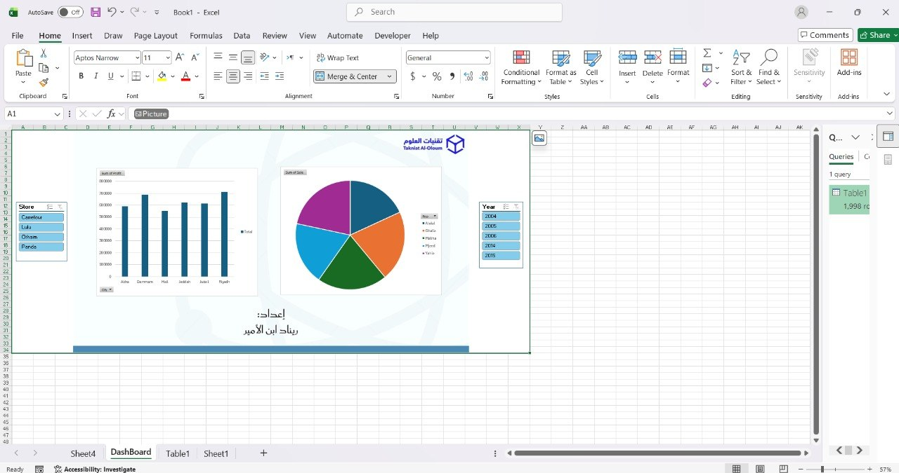

# Excel Sales Dashboard

## Overview
This project demonstrates the creation of an interactive sales dashboard in Microsoft Excel for sales data analysis.

## Skills Used
- Power Query
- Pivot Tables
- Pivot Charts
- Slicers
- Dashboard Design

## Dashboard Preview

## Project Features
- Cleaned and transformed data using Power Query.
- Built interactive Pivot Tables and Pivot Charts.
- Added slicers to filter data by Store and Year.
- Created an interactive dashboard to analyze Sales and Profit.

## Project Files
- Excel Dashboard (.xlsx)
- Dashboard Screenshot
- Power Query Screenshot
- Pivot Tables & Charts Screenshot

## View the Interactive Dashboard

📊 Open the Excel Dashboard (View Only)

[Open Dashboard](https://1drv.ms/x/c/30c943a9a855dba3/IQBZ_mgb-50xS7TcLt1yiyOXAS2sG8f0JR0LG6yRoJD1lXM?e=gWSwSP)
